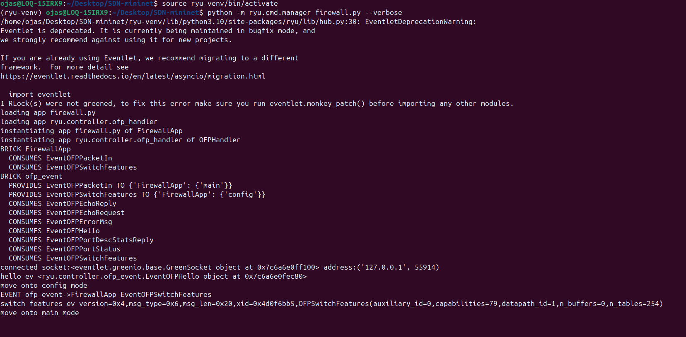
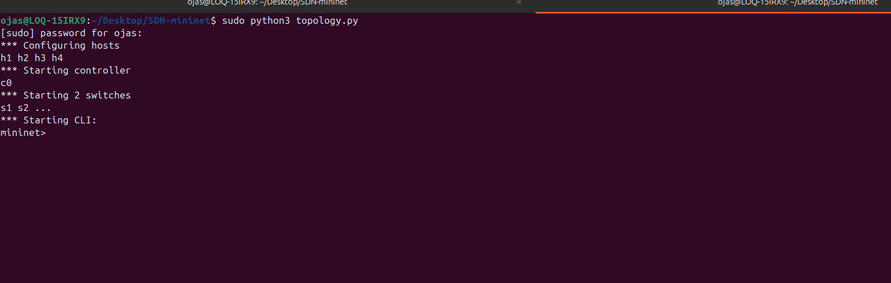
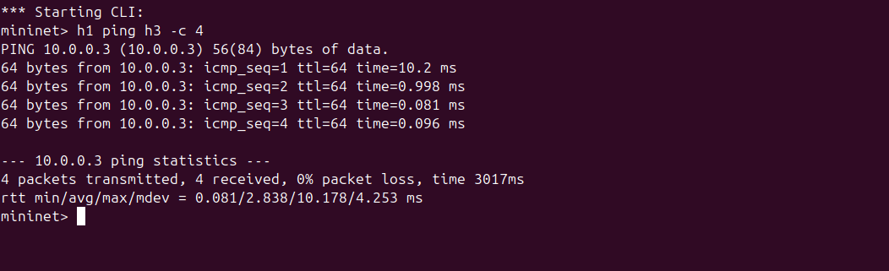
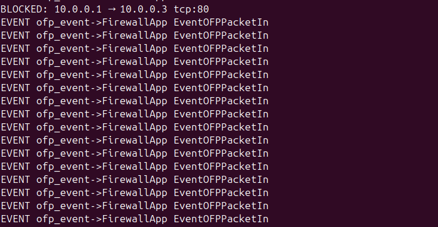
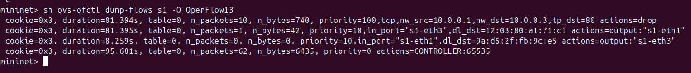

# SDN-Based Firewall Using Mininet & Ryu

A Software-Defined Networking (SDN) firewall implemented using **Mininet** as the network emulator and **Ryu** as the SDN controller. This project demonstrates how a centralized controller can enforce firewall rules across a virtual network by programming OpenFlow switches in real time.

> **Course Project** — Computer Networks

---

## Table of Contents

- [Overview](#overview)
- [Architecture](#architecture)
- [Project Structure](#project-structure)
- [Prerequisites](#prerequisites)
- [Installation](#installation)
- [Running the Project](#running-the-project)
- [Testing the Firewall](#testing-the-firewall)
- [Firewall Rules](#firewall-rules)
- [How It Works](#how-it-works)
- [Screenshots](#screenshots)
- [Known Limitations](#known-limitations)

---

## Overview

In a traditional network, each router/switch makes its own forwarding decisions. In an SDN network, the **control plane** (decision-making) is separated from the **data plane** (packet forwarding). This project leverages that separation to implement a firewall entirely in software:

- The **Ryu controller** acts as the centralized brain
- **Open vSwitch (OvS)** instances in Mininet act as the programmable switches
- The controller inspects each new packet flow and either installs a **drop rule** or a **forward rule** in the switch's flow table

This means firewall logic lives in Python code — not in dedicated hardware.

---

## Architecture

```
┌─────────────────────────────────────┐
│         APPLICATION LAYER           │
│   FirewallApp (Ryu)  ·  REST API    │
└──────────────┬──────────────────────┘
               │  Northbound API
┌──────────────▼──────────────────────┐
│          CONTROL LAYER              │
│   Ryu Controller  (127.0.0.1:6653) │
└──────────┬───────────────┬──────────┘
           │  OpenFlow 1.3 │
┌──────────▼───┐       ┌───▼──────────┐
│  OvS Switch  │───────│  OvS Switch  │
│     s1       │       │     s2       │
└──┬───────┬───┘       └──┬───────┬───┘
   │       │              │       │
  h1      h2             h3      h4
10.0.0.1 10.0.0.2    10.0.0.3  10.0.0.4
```

---

## Project Structure

```
sdn-firewall/
│
├── firewall.py          # Ryu controller application (firewall logic)
├── topology.py          # Mininet custom topology
├── screenshots/         # Demo screenshots (see Screenshots section)
│   ├── 01_controller_start.png
│   ├── 02_mininet_start.png
│   ├── 03_ping_allowed.png
│   ├── 04_http_blocked.png
│   └── 05_flow_table.png
├── screenshots.txt      # Screenshot descriptions (plain text)
└── README.md            # This file
```

---

## Prerequisites

| Tool | Version | Purpose |
|------|---------|---------|
| Ubuntu | 20.04 / 22.04 | Recommended OS |
| Python | 3.8+ | Runtime |
| Mininet | 2.3+ | Network emulation |
| Ryu | 4.34+ | SDN controller |
| Open vSwitch | 2.13+ | Virtual switches |

---

## Installation

**1. Install Mininet**
```bash
sudo apt-get update
sudo apt-get install mininet -y
```

**2. Install Ryu**
```bash
pip install ryu
```

**3. Verify Open vSwitch**
```bash
sudo ovs-vsctl show
```

**4. Clone this repository**
```bash
git clone https://github.com/YOUR_USERNAME/sdn-firewall.git
cd sdn-firewall
```

---

## Running the Project

You need **two terminals open at the same time**.

**Terminal 1 — Start the Ryu controller**
```bash
ryu-manager firewall.py --verbose
```

You should see:
```
loading app firewall.py
instantiating app firewall.py of FirewallApp
```

**Terminal 2 — Start the Mininet topology**
```bash
sudo python3 topology.py
```

Wait for the `mininet>` prompt to appear before running any tests.

---

## Testing the Firewall

Run these commands inside the **Mininet CLI**:

```bash
# Test 1: ICMP ping — should SUCCEED (not blocked)
mininet> h1 ping h3 -c 3

# Test 2: HTTP to h3 — should FAIL (blocked by firewall rule)
mininet> h1 wget -qO- http://10.0.0.3

# Test 3: Telnet anywhere — should FAIL (blocked globally)
mininet> h1 telnet 10.0.0.2

# Test 4: View the flow table to confirm drop rules are installed
mininet> sh ovs-ofctl dump-flows s1 -O OpenFlow13

# Test 5: Check connectivity between all hosts
mininet> pingall
```

**Expected output for Test 4** — you should see a rule like:
```
priority=100,tcp,nw_src=10.0.0.1,nw_dst=10.0.0.3,tp_dst=80 actions=drop
```

---

## Firewall Rules

| # | Source IP | Destination IP | Protocol | Port | Action |
|---|-----------|---------------|----------|------|--------|
| 1 | 10.0.0.1 | 10.0.0.3 | TCP | 80 | DROP |
| 2 | any | any | TCP | 23 | DROP | 
| 3 | any | any | TCP | 22 | DROP |
| * | any | any | any | any | ALLOW |

Rules are defined in `firewall.py` inside `self.blocked_rules` and can be extended without touching any other part of the code.

---

## How It Works

### Step-by-step packet flow

1. **Switch connects** → controller installs a "table-miss" rule (priority 0): *send all unknown packets to me*
2. **New packet arrives** at a switch → no matching rule → Packet-In event sent to controller
3. **Controller unpacks** the packet headers (IP src/dst, protocol, port)
4. **Firewall check** runs against `blocked_rules` list
5a. **If blocked** → controller sends back a flow rule with `actions=[]` (drop), installed at priority 100. All future packets of that type are dropped at the switch — no controller involvement needed
5b. **If allowed** → controller learns the MAC→port mapping and installs a forward rule at priority 10
6. The switch handles all subsequent packets of that flow **locally at wire speed**

### Priority system

```
Priority 100  →  DROP rules   (firewall blocks)
Priority  10  →  FORWARD rules (learned flows)
Priority   0  →  TABLE-MISS   (send to controller)
```

Higher priority always wins.

---

## Screenshots

### 1. Controller startup

> Run `ryu-manager firewall.py --verbose` in Terminal 1. You should see the FirewallApp loading and the controller listening on port 6653.



---

### 2. Mininet topology launch

> Run `sudo python3 topology.py` in Terminal 2. Hosts h1–h4 and switches s1–s2 are created and the switches connect to the Ryu controller via OpenFlow.



---

### 3. Ping allowed — ICMP passes through

> Run `h1 ping h3 -c 3` inside the Mininet CLI. ICMP is not in the blocklist so all 3 packets succeed. This shows the firewall only blocks what it's told to — not all traffic.



---

### 4. HTTP blocked — firewall in action

> Run `h1 wget -qO- http://10.0.0.3` inside the Mininet CLI. TCP port 80 from h1 to h3 matches Rule #1 and is dropped. The controller terminal should simultaneously print `BLOCKED: 10.0.0.1 -> 10.0.0.3 tcp:80`.



---

### 5. Flow table — drop rule installed in the switch

> Run `sh ovs-ofctl dump-flows s1 -O OpenFlow13` inside the Mininet CLI. This is the most important screenshot — it proves the controller programmed the switch with a real drop rule at priority 100. The switch now enforces the firewall at line speed without the controller.



---

## Known Limitations

- **No stateful inspection** — rules match on packet headers only, not TCP connection state
- **Single point of failure** — if the Ryu process crashes, switches fall back to flooding or drop all traffic
- **Rules are not persistent** — restarting the controller clears all dynamically installed rules
- **No authentication** on the OpenFlow channel — any switch can connect
- **Vulnerable to IP spoofing** — source IP is trusted without MAC verification
- **Controller bottleneck** — a flood of new flows overwhelms the Packet-In queue

These are inherent trade-offs of a simple learning-switch + blocklist design and are well-known challenges in production SDN deployments.

---

## References

- [Ryu SDN Framework Documentation](https://ryu.readthedocs.io/)
- [Mininet Documentation](http://mininet.org/api/annotated.html)
- [OpenFlow 1.3 Specification](https://opennetworking.org/wp-content/uploads/2014/10/openflow-spec-v1.3.0.pdf)
- [Open vSwitch Documentation](https://docs.openvswitch.org/)
